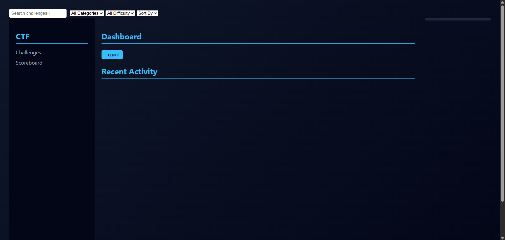
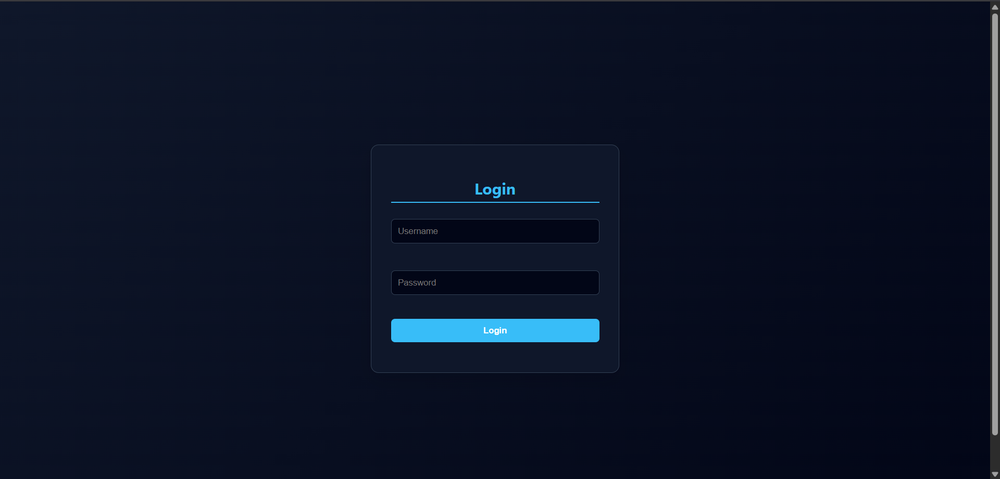

# CTF-WEB

A custom beginner-friendly CTF platform built with FastAPI, SQLite, HTML/CSS/JS

## Features
- JWT Auth.
- 3 Demo Challenges with room for future scalability.
- Scoreboard.
- First-Blood tracking.
- A MVP Admin Panel.
- A category-wise filtering system for challenge viewing.
- Deduct points for revealing each hint.

## Default Admin Credentials
```
Username: admin
Password: admin
```

## Setup
```bash
pip install -r requirements.txt
python -m uvicorn main:app --reload #run in the backend directory or in the directory that has the main.py file:)
``` 
All others are self-explanatory I hope, and the [3 Demo challenges](media/Adding_3_full-on_challenges.mp4) are in the attached video, so please refer to it and all the demo users are removed so feel free to create new ones during testing or local use:)

## Dashboard-UI



# 

## Admin-UI


# 

## Login UI



# 

## Sign-up UI


# 

